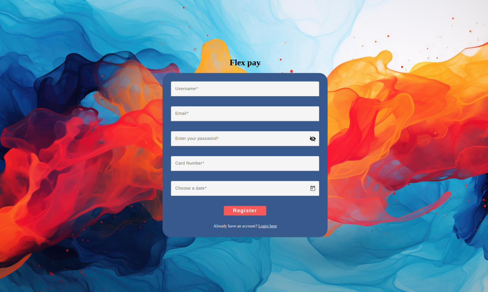
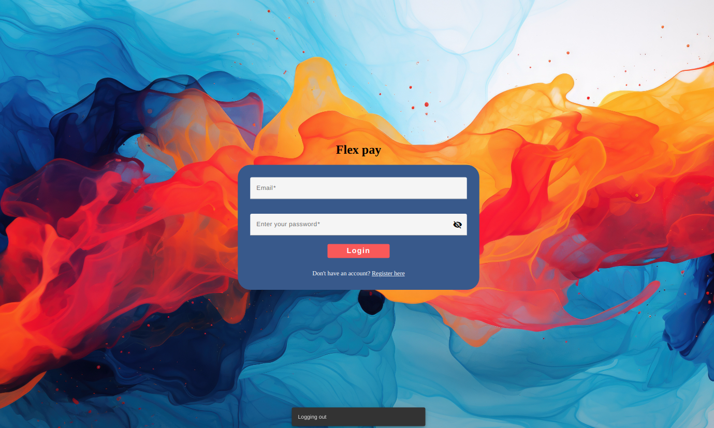
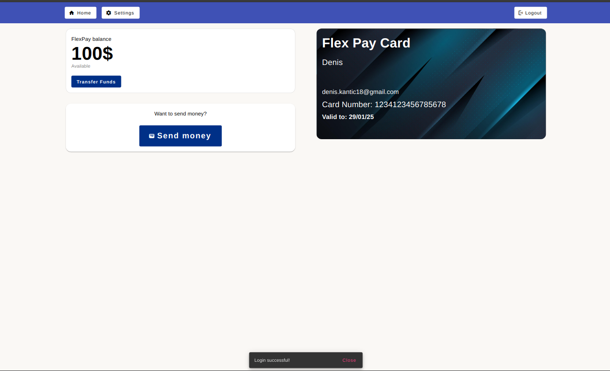
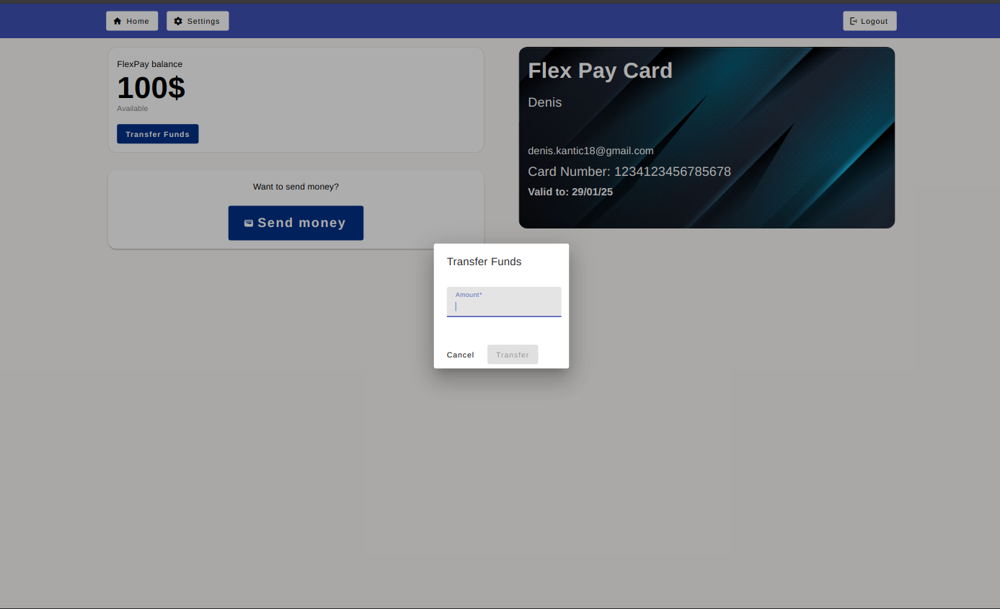
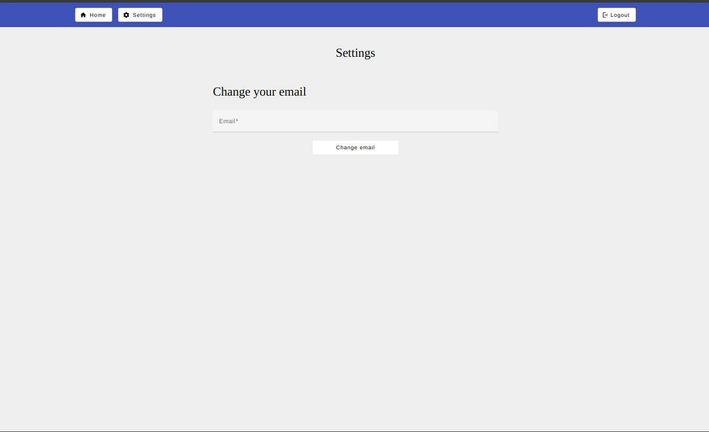

## Flex Pay Project

Project made for faculty purposes. Interesting project
demonstrating my skills as full stack software engineer. 

## Technologies used

### Frontend
- Angular (19 version)
- Angular Material (for prebuilded components)
- Angular Guard (for middleware)
- CSS 
- Axios (for http protocols)

### Backend

- Golang 1.22 version (Gin framework)
- SMTP service (email service to send email after registration)
- .env variables

### Database

- PostgreSQL (with procedures and functions)

### Docker

- Docker (used with dockerfile to spin up postgres database via docker compose up command)

 

---

## STEPS FOR STARTING THE PROJECT

## Requirements

- NodeJS version 20 and up 
- Angular 19 version 
- Golang installed (if not you can run it via Docker, steps are included below)
- Docker 

### Frontend part
- First clone this project, enter inside the terminal and type **npm install** to install dependencies
- After that, type **ng serve** to start localhost:4200 project inside browser

### Backend part

- Clone the repo here **https://github.com/DenisKantic/flex_pay_backend_golang**
- Open it in your IDE and run it (I'm using GoLand IDE from JetBrains)

**OPTIONAL**
If you don't have Go installed on your computer, you can edit the docker file
inside the root folder called **docker-compose.yaml**. There you have already Golang instructions commented. Uncomment them and modify it so it can be run together with Postgres, when you use the command **docker compose up --build** 

### Database part

- Since I didn't included the docker external volume you would need to create it with the name "flex-data". 
- Create docker volume with the command **docker volume create flex-data**
- Copy all the postgres commands for creating table, procedures... from the root file "database_notes.txt"
- After that part, check did it created all the tables, procedures...
- Start the database (alongside with Golang if you don't wanna run it locally) with the command **docker compose up --build**. If the command doesn't start, run **sudo docker compose up --build --remove-orphans**"

### About Flex Pay

Flex pay is basically very simple PayPal clone. Done just for demonstrating my skills so that's the reason it is simple.

--- 
### How does it function?

FlexPay has Login and Register screens. To use the app, you need to first create your account. After creation, you will be redirected to the login screen, where you will use your credentials to log in.

After login you will be redirected to dashboard page. There you will see your balance (which is $100 by default). In there you can enter "settings" to change your email, or inside dashboard to "transfer your founds"...

## SCREENS

- ### Register 
When you register, you will receive a snackbar notification below centered that is either succesfull or not. 
Every input field inside the form is reactive and error checked. You can't submit empty form nor the one empty field. Also error check is done if the email is in the correct format, does the card number has 16 numbers and a valid date for the card (you can't enter the previous date, only the "future" date.). Error check for date is done via backend in Golang.

- ### Login

When you login, you will get a JWT token stored in your cookie session. Angular Guard is checking your JWT token and acts as middleware. You can't access dashboard manually typing the route in URL or any route inside the dashboard, unless you have a valid JWT token or you don't have it at all. 
If you have it, it will be checked via API on backend Golang. If it's not matching or you don't have it at all, you will be redirected to the "/login" path.

- ### Dashboard 
As you can see, when you enter your dashboard, on the right side you have a "card styled" informations which you have entered upon your registration. On the left side you have your current balance and two options for "transfering funds" and "send money".
Option "send money" is just cosmetic for now, it's not working.

- ### Dashboard (Transfer founds)

When you click on the button for "transfer founds", you will have a new modal across the whole screen opened. In there you can enter your amount or cancel the procedure. 
Error check is also done in frontend part and in postgres procedure. You can't transfer the amount which exceeds your current status (for example you have $100 and you want to transfer $200).

- ### Dashboard/Settings 

In here, you can change your email address to different one. Also error check is done to check if email is in valid format.

- ### Logout

There is no screen for this part. When you click on "logout" button you will be redirected to the Login page and your jwt token in cookies will be deleted. Also to stop errors on login, when you click on "Login" button, first your jwt token will be deleted and then the API for POST method "login" will be fired. That's done just in case if something bad happened with "logout button" or the cookies aren't deleted when you click on "logout".